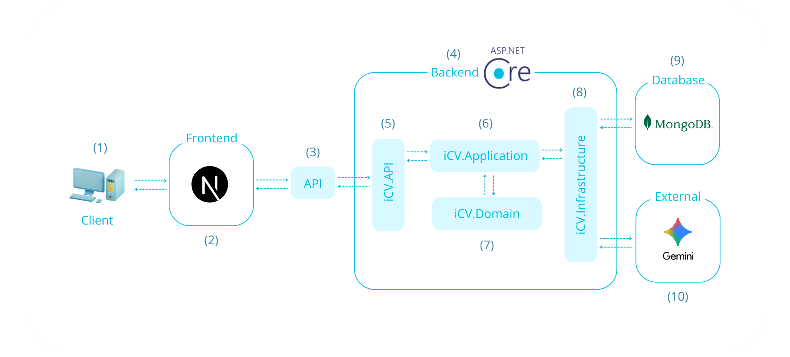

## 📄iCV - Hệ thống tạo và đánh giá hồ sơ xin việc tích hợp AI

    

### ℹ️ Thông tin chung
- **Sinh viên thực hiện:** Nguyễn Đình Trí  
- **Giáo viên hướng dẫn:** Nguyễn Bảo Ân  
- **Mssv:** 110121119  
- **Email:** [tringuyen.21092003@gmail.com](mailto:tringuyen.21092003@gmail.com)  
### 📝 Giới thiệu
iCV là nền tảng hiện đại giúp bạn biến việc tạo CV trở nên dễ dàng và tối ưu hơn bao giờ hết. Với sự kết hợp giữa thiết kế trực quan và AI mạnh mẽ, iCV không chỉ giúp bạn xây dựng một bản CV đẹp mắt mà còn đánh giá, phân tích và đề xuất cải thiện để tăng cơ hội chinh phục nhà tuyển dụng.
### 🎯 Mục tiêu dự án
Xây dựng một hệ thống hỗ trợ người dùng tạo, quản lý và tối ưu hóa hồ sơ xin việc với sự hỗ trợ của trí tuệ nhân tạo (AI). Cụ thể, dự án tập trung vào:
- **Phát triển nền tảng linh hoạt:** Cho phép người dùng tạo, chỉnh sửa, xóa CV với giao diện kéo-thả trực quan.
- **Ứng dụng công nghệ hiện đại** Sử dụng Next.js (frontend), ASP.NET Core API (backend) và MongoDB (database) để đảm bảo hiệu năng và khả năng mở rộng.
- **Tích hợp AI đánh giá CV** Sử dụng Gemini API để phân tích nội dung CV, chấm điểm và gợi ý cải thiện dựa trên yêu cầu công việc.
- **Hoàn thiện tính năng cốt lõi** Bao gồm quản lý tài khoản, tạo & chỉnh sửa CV, đánh giá bằng AI,...
### 🔑 Tính năng chính
- **Tạo CV trực quan:** với giao diện kéo-thả và nhiều mẫu thiết kế tùy chỉnh  
- **Đăng nhập linh hoạt:** qua Email/Mật khẩu hoặc Google  
- **Quản lý CV:** Lưu trữ, chỉnh sửa, xuất PDF hoặc chia sẻ qua link công khai/riêng tư  
- **Đánh giá CV (AI):** dựa trên JD, chấm điểm và gợi ý cải thiện  
- **Nhập CV từ PDF (AI):** Tự động trích xuất và phân loại nội dung  
- **Dịch thuật CV (AI):** giữa Tiếng Việt và Tiếng Anh  
### 🏗️ Kiến trúc hệ thống

Trong đó:
(1): Các trình duyệt của người dùng.  
(2): Giao diện người dùng, nơi người dùng tương tác với hệ thống.  
(3): Các API từ server.  
(4): Máy chủ ứng dụng ASP.NET Core Web API xử lý các yêu cầu từ client.  
(5): Đây là lớp chịu trách nhiệm cho các controller, middleware,… định tuyến và xử lý yêu cầu.  
(6): Lớp chứa logic nghiệp vụ, các use case và luồng công việc đặc thù của ứng dụng.  
(7): Lớp chứa các thực thể, logic nghiệp vụ và mô hình cốt lõi.  
(8): Lớp này chứa các truy cập dữ liệu, dịch vụ và tích hợp với các hệ thống bên ngoài, chẳng hạn như giao tiếp với API của bên thứ ba và các thao tác cơ sở dữ liệu.  
(9): Cơ sở dữ liệu nơi dữ liệu của ứng dụng được lưu trữ.  
(10): Các dịch vụ bên ngoài như Gemini (thông qua api) mà ứng dụng tương tác, thông qua lớp Infrastructure.  
